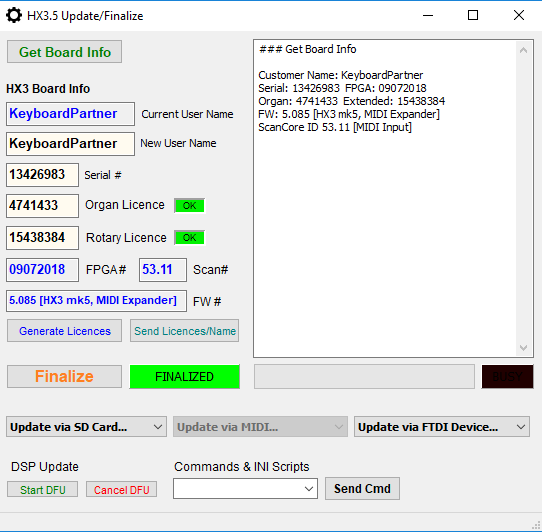

# Updating HX3.5 with HX3.5 Editor

**Using MIDI or MIDI over USB connection**

### Connection

HX3.5 Editor connects to HX3.5 mainboard either through bi-directional MIDI 
connection (IN/OUT) using a third-party MIDI adaptor, by MIDI over USB using a 
USB connection or by our FTDI serial adaptor cable. Also, any FTDI device with 
FT232 chip as our FTDI serial adaptor board may be used. Power up HX3.5, Open 
HX3.5 Editor application and click on Connect. A dialog window will appear which 
asks for the MIDI or FTDI device to use. Note: FTDI connection is somewhat 
faster than MIDI.

### MIDI connection

When HX3.5 is connected to your PC's USB port, it will appear as "HX3_USB" in 
list of input/output devices. Per default, these items are checked in HX3.5 
Editor's Connect window, so connection will use the MIDI over USB. Protocol is 
proprietary SysEx, so other devices will not respond to HX3.5 Editor commands. 
Note: On some PCs, intermediate USB hubs will not work -- use a direct USB 
connection instead.

For updates, entering extended licences or changing Scan Driver from MIDI to 
FatarScan2 or Scan16/61, click on HX3.5 Update/Finalize. A window will open 
showing active board licences and serial number. Make sure at least Organ 
Licence "LED" is lit.

### Scan Drivers Update

Select "Scan Driver file" from drop-down menu (either via MIDI or via FTDI 
device). HX3.5 Editor will prompt for a Scan Driver .DAT file (either 
scanmidi.DAT or scanfatr.DAT at this time). Scan Drivers can be found in UPDATE 
directories resp. ZIP files.

### FPGA and Firmware Updates

Analog to Scan Driver updates, individual parts may be updated by file upload 
also, using a MIDI USB or FTDI cable serial connection. Please note: File 
transfer of FPGA (sound engine) configuration may take up to 10 minutes using a 
MIDI connection or up to 4 minutes using the FTDI serial cable. For a complete 
update, each file must be uploaded individually! For experienced users: You may 
skip some files if their creation date is not different from those already 
installed.

### Extended Licences

Make sure that green Organ Licence "LED" is already lit. To install an Extended 
Licence, enter number in Extended Licence text field and click Send 
Licences/Name.

See [HX3.5 Editor manual](http://wiki.keyboardpartner.de/index.php?title=HX3.5_Editor)
for further details.